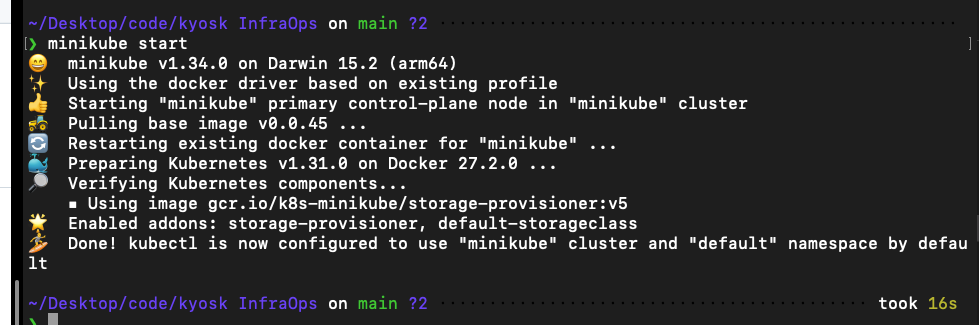
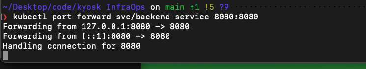
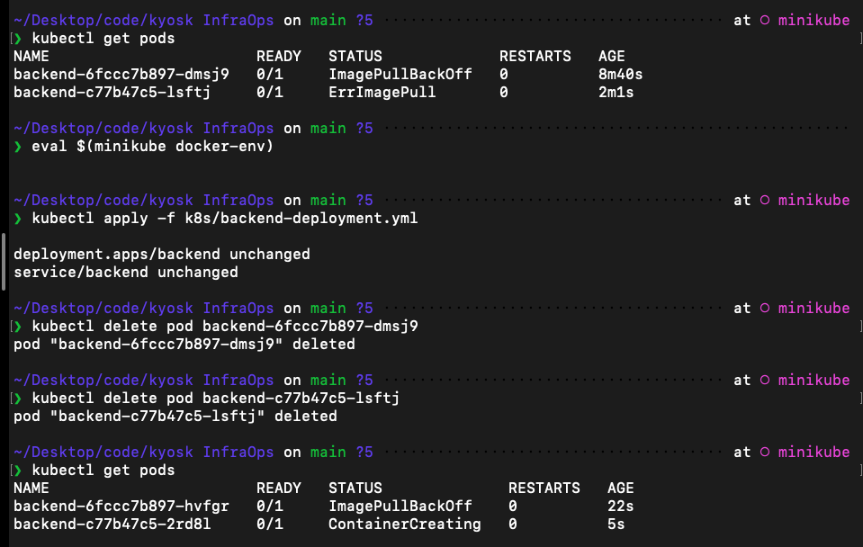

# Movie Management Application

This application consists of a Spring Boot backend and an Angular frontend, containerized with Docker and deployed using Kubernetes.

Dockerhub link: https://hub.docker.com/u/gicheha
github link: https://github.com/gicheha
project repo link: https://github.com/Morgan-Gicheha/Ky-moviesK8S


### running the project
clone the repo
1. `git clone https://github.com/Morgan-Gicheha/Ky-moviesK8S.git`

change directory to the project

2. `cd Ky-moviesK8S`

start minikube

3. `minikube start`

apply the manifests

4. `kubectl apply -f k8s/`

port forward the backend service

5. `kubectl port-forward svc/backend-service 8080:8080 #mac`

port forward the frontend service

6. `kubectl port-forward svc/frontend-service 8081:80 #mac`

open the frontend in the browser

7. `http://localhost:8081`


## Git commands
add: `git add .`

commit: `git commit -m "commit message"`


push: `git push`

## Docker Image Management

### Building and Pushing Images
```bash
# Build and push frontend image
docker build -t gicheha/frontend .
docker push gicheha/frontend
```


### GitHub Actions Workflow
Automated build and push to Docker Hub:


## Backend (Spring Boot)

### Build and Run Backend

```bash
# Build Docker image for backend
docker build -t backend:latest ./backend

# Create Docker network for communication between services
docker network create movie-network

# Run MongoDB container
docker run -d --name mongodb \
    --network movie-network \
    -p 27017:27017 \
    mongo:6.0

# Run backend application
docker run -d --name movie-app \
    --network movie-network \
    -p 8080:8080 \
    -e SPRING_DATA_MONGODB_HOST=mongodb \
    backend:latest
```

### Important Backend Endpoints
- `GET /movies` - Retrieve all movies
- `POST /movies` - Add a new movie
- `GET /health` - Check application health status

## Kubernetes Deployment

### Starting Minikube
```bash
minikube start
```


### Applying Manifests

1. Apply Backend Manifest:
```bash
kubectl apply -f k8s/backend-deployment.yml
```


2. Apply All Manifests:
```bash
kubectl apply -f k8s/
```


### Port Forwarding
```bash
kubectl port-forward svc/backend-service 8080:8080
```


### Running Cluster
View of the running Kubernetes cluster:


### Debugging
When encountering issues:



## Frontend (Angular)

### Prerequisites
- Node.js and npm installed
- Angular CLI (`npm install -g @angular/cli`)

### Initial Project Setup

```bash
# Create new Angular project
ng new frontend
cd frontend

# Install Angular Material
npm install @angular/material @angular/cdk

# Generate core components
ng generate component components/home
ng generate component components/layout/header
ng generate component components/layout/footer
ng generate component components/shared/loading-spinner

# Generate services
ng generate service services/api

# Generate interfaces
ng generate interface models/api-response
```

### Project Structure
```
frontend/
├── src/
│   ├── app/
│   │   ├── components/
│   │   │   ├── home/
│   │   │   ├── layout/
│   │   │   │   ├── header/
│   │   │   │   └── footer/
│   │   │   └── shared/
│   │   │       └── loading-spinner/
│   │   ├── services/
│   │   │   └── api.service.ts
│   │   └── models/
│   │       └── api-response.ts
│   └── styles.css
```

### Run Application

```bash
#navigate to frontend directory
cd frontend

# Install dependencies
npm install


# Start development server
ng serve
```

The application will be available at `http://localhost:4200`

### Features
- Material UI design with responsive layout
- Form for adding new movies with validation
- Display list of all movies
- Success/Error notifications using snackbar
- Real-time form validation

### Important Files
- `src/app/components/home/home.component.ts` - Main component with movie management functionality
- `src/app/services/api.service.ts` - Service for backend API communication
- `src/styles.css` - Global styles including Material theme

### API Integration
The frontend communicates with the backend at `http://localhost:8080/movies` for:
- GET request to fetch all movies
- POST request to add new movies

## Development Notes

### Docker Commands
- `docker ps` - List running containers
- `docker logs [container-name]` - View container logs
- `docker stop [container-name]` - Stop a container
- `docker rm [container-name]` - Remove a container

### Environment Variables
Backend environment variables can be configured:
- `MONGODB_HOST` - MongoDB host (default: localhost)
- `MONGODB_PORT` - MongoDB port (default: 27017)
- `MONGODB_DATABASE` - Database name (default: moviedb)


### pushing to docker hub
```
❯ docker build -t gicheha/frontend .
❯ docker push gicheha/frontend
```

```
❯ docker build -t gicheha/kyoskbackend .
❯ docker push gicheha/kyoskbackend
```